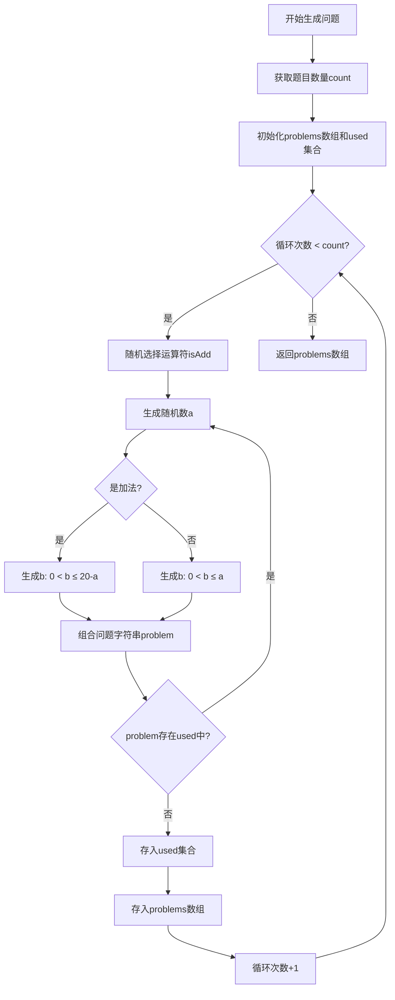

# 口算闪卡

如何训练一年级儿童的专注力？口算闪卡是个不错的练习工具。所谓闪卡(Flash Card)就是快速给娃出一些简单的算术题，让他必须按顺序写出序号和对应的答案。本代码参考了娃的数学老师的PPT课件，在我设计的提示词下，由DeepSeek R1生成。

[点击这里直接进入闪卡测试](https://bg6lh.github.io/Flash-Card-Math-Quiz/math-quiz.html)

## 提示词设计

我向DeepSeek提出了一系列要求，DeepSeek在第二轮对话中就完成了正确的代码。之后我又陆续对用户界面和易用性提了一些要求。大致整理如下：

```text
假设你是一个网页前端工程师，帮我写一个页面：
- 在黑屏的浏览器上，随机、不重复地输出答案由20以内数字组成的加减法题，避免出现负数答案，位置随机，不能超出屏幕，每道题，停留2秒；
- 开始出题前，请把出题数目、停留时间，提取为变量，放在网页的前部，可以由用户自定义；
- 出完所有题之后是黑屏等待，并提示在按任意键后输出答案；
- 按任意键后，按出题顺序输出每道题的编号、公式，和正确答案，使用`<table>`标签输出，对齐编号、运算符号，如果内容太长，网页可以滚动显示，可以显示滚动条。
- 网页基本字体改为24px，出题时字体题目字体用200px，加粗。
```

## “20以内加减法”的定义

老师并没有告诉我特别精准的定义。我给AI提出的要求是：“答案由20以内的数字组成的加减法题”，和“避免出现负数答案“。

> 这个要求在另一个AI里出现了`98-83=`这样的题，虽然答案没超过20，但对一年学生有点超纲了。

DeepSeek自己推理是：

>……关于生成题目，加减法要随机选择，同时保证结果非负。比如，如果是减法，需要确保被减数大于等于减数。可以先生成运算符，再根据运算符生成合适的数。例如，加法的话，两个数相加不超过20；减法的话，第一个数大于等于第二个数，结果也不超过20……

之后，它直接在20以内随机挑选加减数。最终做到了总和小于等于20（儿童加法题），并且结果不是负数（基础减法题）。挺靠谱。

以下是Deepseek写的“20以内加减法”的完整代码：

```javascript
    function generateProblems() {
        const count = getProblemCount();
        const used = new Set();
        problems = [];
        
        while(problems.length < count) {
            const isAdd = Math.random() > 0.5;
            let a, b;
            
            do {
                a = Math.floor(Math.random() * 20) + 1;
                b = Math.floor(Math.random() * (isAdd ? 20 - a : a)) + 1;
                const problem = `${a}${isAdd ? '+' : '-'}${b}=`;
                if (!used.has(problem)) {
                    used.add(problem);
                    problems.push({
                        num1: a,
                        operator: isAdd ? '+' : '-',
                        num2: b + '=',
                        answer: isAdd ? a + b : a - b
                    });
                    break;
                }
            } while(true);
        }
    }
```

我让他用mermaid输出了逻辑流程：



## 版权声明

虽然代码是DeepSeek写的，根据它自己的回答，我[对生成内容享有完整的权利(4-4.2)](https://cdn.deepseek.com/policies/en-US/deepseek-terms-of-use.html)，所以我决定放在这里开源给各位。可以拿去给娃练练。
